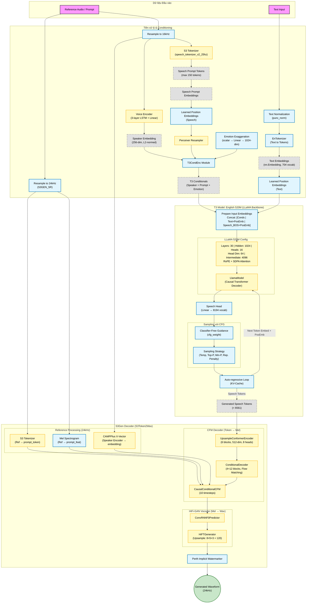

```mermaid
graph TD
    %% Định nghĩa Style
    classDef input fill:#f9f,stroke:#333,stroke-width:2px,color:black;
    classDef process fill:#e1f5fe,stroke:#0277bd,stroke-width:2px,color:black;
    classDef model fill:#fff9c4,stroke:#fbc02d,stroke-width:2px,color:black;
    classDef storage fill:#e0e0e0,stroke:#333,stroke-width:1px,stroke-dasharray:5 5,color:black;
    classDef output fill:#c8e6c9,stroke:#2e7d32,stroke-width:2px,color:black;

    subgraph Inputs ["Dữ liệu Đầu vào"]
        Text["Text Input"]:::input
        RefAudio["Reference Audio / Prompt"]:::input
    end

    subgraph Preprocessing ["Tiền xử lý & Conditioning"]
        direction TB
        
        %% Text Path
        Norm["Text Normalization<br/>(punc_norm)"]:::process
        TextTok["EnTokenizer<br/>(Text to Tokens)"]:::process
        TextEmb["Text Embeddings<br/>(nn.Embedding, 704 vocab)"]:::storage
        TextPosEmb["Learned Position Embeddings<br/>(Text)"]:::process
        
        %% Audio Path - Resample
        RefResample16k["Resample to 16kHz"]:::process
        RefResample24k["Resample to 24kHz<br/>(S3GEN_SR)"]:::process
        
        %% Voice Encoder Path (for T3)
        VE["Voice Encoder<br/>(3-layer LSTM + Linear)"]:::model
        SpkEmb["Speaker Embedding<br/>(256-dim, L2-normed)"]:::storage
        
        %% Prompt Token Path (for T3)
        S3Tok_T3["S3 Tokenizer<br/>(speech_tokenizer_v2_25hz)"]:::model
        PromptToks["Speech Prompt Tokens<br/>(max 150 tokens)"]:::storage
        PromptEmb["Speech Prompt Embeddings"]:::storage
        PromptPosEmb["Learned Position Embeddings<br/>(Speech)"]:::process
        Perceiver["Perceiver Resampler"]:::model
        
        %% Emotion/Exaggeration
        EmotionAdv["Emotion Exaggeration<br/>(scalar → Linear → 1024-dim)"]:::process
        
        %% T3 Conditionals Assembly
        T3CondEnc["T3CondEnc Module"]:::process
        T3Cond["T3 Conditionals<br/>(Speaker + Prompt + Emotion)"]:::storage
    end

    subgraph T3_Model ["T3 Model: English 520M (LLaMA Backbone)"]
        direction TB
        InputPrep["Prepare Input Embeddings<br/>Concat: [Conds | Text+PosEmb | Speech_BOS+PosEmb]"]:::process
        
        subgraph LLaMA_Backbone ["LLaMA 520M Config"]
            LlamaConfig["Layers: 30 | Hidden: 1024 | Heads: 16<br/>Head Dim: 64 | Intermediate: 4096<br/>RoPE + SDPA Attention"]:::model
            Transformer["LlamaModel<br/>(Causal Transformer Decoder)"]:::model
        end
        
        SpeechHead["Speech Head<br/>(Linear → 8194 vocab)"]:::process
        
        subgraph Sampling ["Sampling với CFG"]
            CFG["Classifier-Free Guidance<br/>(cfg_weight)"]:::process
            SamplingStrat["Sampling Strategy<br/>(Temp, Top-P, Min-P, Rep. Penalty)"]:::process
        end
        
        AutoReg["Auto-regressive Loop<br/>(KV-Cache)"]:::process
        SpeechTokens["Generated Speech Tokens<br/>(< 6561)"]:::storage
    end

    subgraph S3Gen_Decoder ["S3Gen Decoder (S3Token2Wav)"]
        direction TB
        
        subgraph S3Gen_RefProc ["Reference Processing (24kHz)"]
            S3Tok_Gen["S3 Tokenizer<br/>(Ref → prompt_token)"]:::model
            MelExtract["Mel Spectrogram<br/>(Ref → prompt_feat)"]:::process
            CAMPPlus["CAMPPlus X-Vector<br/>(Speaker Encoder → embedding)"]:::model
        end
        
        subgraph CFM_Decoder ["CFM Decoder (Token → Mel)"]
            UpsampleEnc["UpsampleConformerEncoder<br/>(6 blocks, 512-dim, 8 heads)"]:::model
            CondDecoder["ConditionalDecoder<br/>(4+12 blocks, Flow Matching)"]:::model
            FlowMatch["CausalConditionalCFM<br/>(10 timesteps)"]:::model
        end
        
        subgraph Vocoder ["HiFi-GAN Vocoder (Mel → Wav)"]
            F0Pred["ConvRNNF0Predictor"]:::model
            HiFT["HiFTGenerator<br/>(Upsample: 8×5×3 = 120)"]:::model
        end
        
        Watermark["Perth Implicit Watermarker"]:::process
    end

    OutputAudio(("Generated Waveform<br/>(24kHz)")):::output

    %% ========== Flow Connections ==========
    
    %% Text Path
    Text --> Norm --> TextTok --> TextEmb
    TextEmb --> TextPosEmb
    
    %% Reference Audio Resampling
    RefAudio --> RefResample16k
    RefAudio --> RefResample24k
    
    %% T3 Conditioning Path (16kHz)
    RefResample16k --> VE --> SpkEmb
    RefResample16k --> S3Tok_T3 --> PromptToks
    PromptToks --> PromptEmb --> PromptPosEmb --> Perceiver
    
    %% T3Cond Assembly
    SpkEmb --> T3CondEnc
    Perceiver --> T3CondEnc
    EmotionAdv --> T3CondEnc
    T3CondEnc --> T3Cond
    
    %% T3 Input Preparation
    T3Cond --> InputPrep
    TextPosEmb --> InputPrep
    
    %% T3 Forward
    InputPrep --> LlamaConfig --> Transformer --> SpeechHead
    SpeechHead --> CFG --> SamplingStrat --> AutoReg
    AutoReg -->|"Next Token Embed + PosEmb"| Transformer
    AutoReg -->|"Speech Tokens"| SpeechTokens
    
    %% S3Gen Reference Processing (24kHz)
    RefResample24k --> S3Tok_Gen
    RefResample24k --> MelExtract
    RefResample16k --> CAMPPlus
    
    %% S3Gen Forward
    SpeechTokens --> UpsampleEnc
    S3Tok_Gen --> FlowMatch
    MelExtract --> FlowMatch
    CAMPPlus --> FlowMatch
    UpsampleEnc --> CondDecoder --> FlowMatch
    
    %% Vocoder
    FlowMatch --> F0Pred --> HiFT
    HiFT --> Watermark --> OutputAudio
```